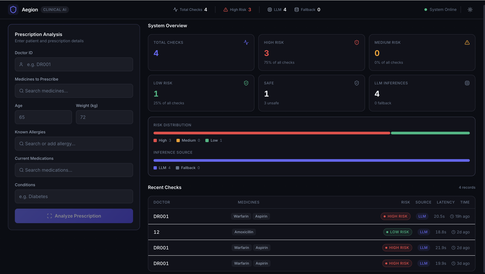
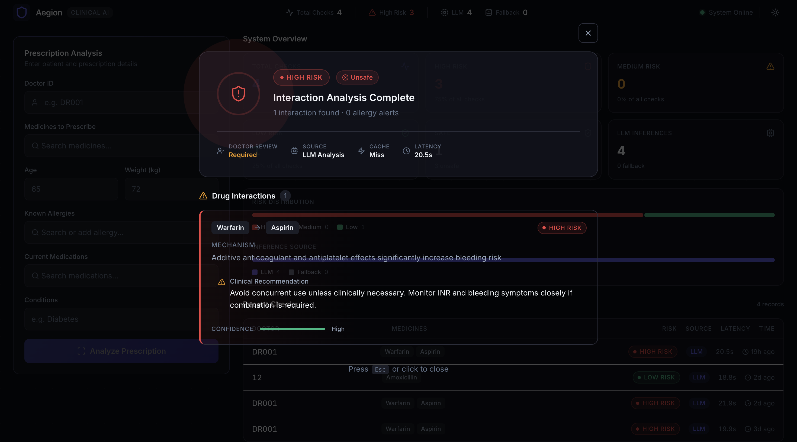

# Aegion — Clinical Drug Safety Engine

Aegion is a clinical drug safety engine designed to detect potentially hazardous prescription drug interactions using a hybrid AI + rule-based architecture.

Built using local LLM inference with Ollama and Qwen 2.5, the system provides explainable clinical risk analysis, severity classification, deterministic fallback validation, and privacy-first on-premise deployment for healthcare environments.

---

## Tech Stack


## Demo Video

[](assets/videos/Aegion-recording.mp4)

---

# Why Aegion?

Modern AI healthcare systems often rely heavily on cloud inference and opaque model outputs, creating challenges around:

- patient data privacy
- explainability
- reliability
- deterministic safety validation

Aegion was built to explore a safer engineering approach for AI-assisted clinical systems using:

- local LLM inference
- hybrid rule-based validation
- explainable interaction analysis
- on-premise deployment architecture

Instead of functioning as a generic AI chatbot, Aegion behaves like an operational clinical safety engine.

---

# Core Features

### Hybrid AI + Rule-Based Architecture
Combines deterministic medical interaction rules with LLM-powered clinical reasoning.

### Fully Local Inference
Runs entirely using Ollama + Qwen 2.5 without external API dependency.

### Privacy-First Deployment
Designed for on-premise deployment where sensitive healthcare data must remain local.

### Intelligent Fallback System
If LLM inference fails, the system falls back to deterministic interaction logic.

### Clinical Severity Classification
Categorizes prescription interactions into multiple risk levels for faster prioritization.

### Explainable Clinical Reasoning
Provides:
- interaction mechanism
- clinical impact
- medical recommendations
- monitoring guidance

instead of opaque AI responses.

### Operational Observability
Tracks:
- inference latency
- cache hit/miss status
- fallback usage
- risk distribution
- recent prescription analyses

### Unified Application Deployment
Frontend and backend are integrated into a single FastAPI application for simplified deployment.

---

# System Workflow

```text
Prescription Input
        ↓
Cache Lookup
        ↓
Rule-Based Interaction Engine
        ↓
Local LLM Clinical Reasoning
        ↓
Severity Classification
        ↓
Database Logging
        ↓
Clinical Safety Response
```

---

# Architecture Highlights

## Local LLM Inference

Aegion uses Ollama with Qwen 2.5 to perform fully local inference.

**Model Selection Rationale:** A generalized LLM (Qwen 2.5) was intentionally chosen over domain-specific medical LLMs (like BioMistral). Through extensive testing, generalized models demonstrated superior strict adherence to system prompts and structured JSON formatting. This significantly reduces hallucinations and parsing errors compared to medically fine-tuned models, which often over-generate text or deviate from strict operational constraints.

This ensures:
- zero cloud dependency
- reduced privacy risk
- offline capability
- improved suitability for healthcare environments

---

## Deterministic Safety Layer

The system does not rely entirely on generative AI.

A deterministic fallback interaction engine independently validates known unsafe drug combinations using structured interaction rules.

This architecture improves:
- reliability
- explainability
- safety
- operational resilience

---

## Performance Optimization

A TTL-based caching layer stores previous prescription analyses to reduce repeated inference latency.

Repeated interaction checks can return responses approximately 95% faster.

---

## Database Abstraction

The persistence layer uses SQLAlchemy ORM, allowing easy migration from SQLite to PostgreSQL without major architectural changes.

---

# Dashboard Capabilities

The Aegion dashboard provides:

- prescription analysis
- interaction severity visualization
- latency monitoring
- cache observability
- inference source tracking
- recent clinical checks
- fallback system visibility

The interface was intentionally designed to resemble operational healthcare systems rather than generic AI chat interfaces.

---

# Project Structure

```text
backend/
├── data/
│   └── fallback_interactions.json
├── prompts/
│   └── system_prompt.txt
├── test/
├── cache.py
├── database.py
├── db_models.py
├── engine.py
├── main.py
└── requirements.txt

frontend/
├── api/
├── components/
├── constants/
├── context/
├── hooks/
└── App.jsx
```

---

# Running Aegion Locally

## Clone the Repository

```bash
git clone https://github.com/your-username/aegion.git
cd aegion
```

---

## Install Backend Dependencies

```bash
cd backend
pip install -r requirements.txt
```

---

## Install Ollama

Download and install Ollama:

https://ollama.com

---

## Pull the Qwen Model

```bash
ollama pull qwen2.5
```

---

## Run the Application

```bash
uvicorn main:app --reload
```

The frontend is integrated directly into the FastAPI application, enabling single-command local deployment.

---

# Screenshots & Media

## Dashboard Overview


---

## Clinical Interaction Analysis


---

# Engineering Learnings

Building Aegion involved practical engineering challenges across:

- AI orchestration
- local LLM inference
- backend architecture
- healthcare privacy constraints
- caching optimization
- explainable AI workflows
- API design
- reliability engineering

---

# Future Improvements

- PostgreSQL migration
- Dockerized deployment
- Expanded clinical interaction datasets
- Async inference optimization
- EHR integration
- Role-based authentication
- Enhanced audit logging
---

<div align="center">
  <h2>Thank You</h2>
</div>