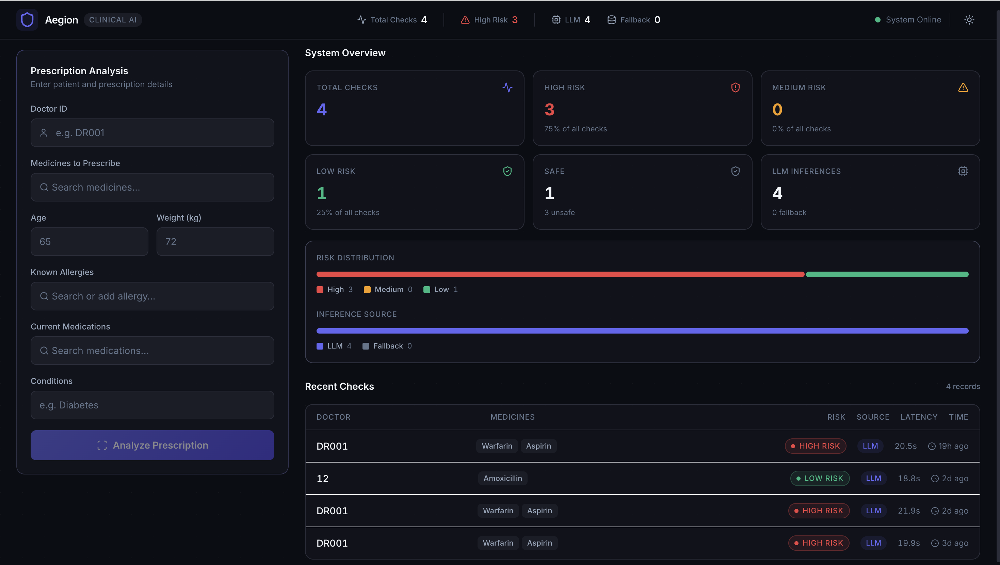
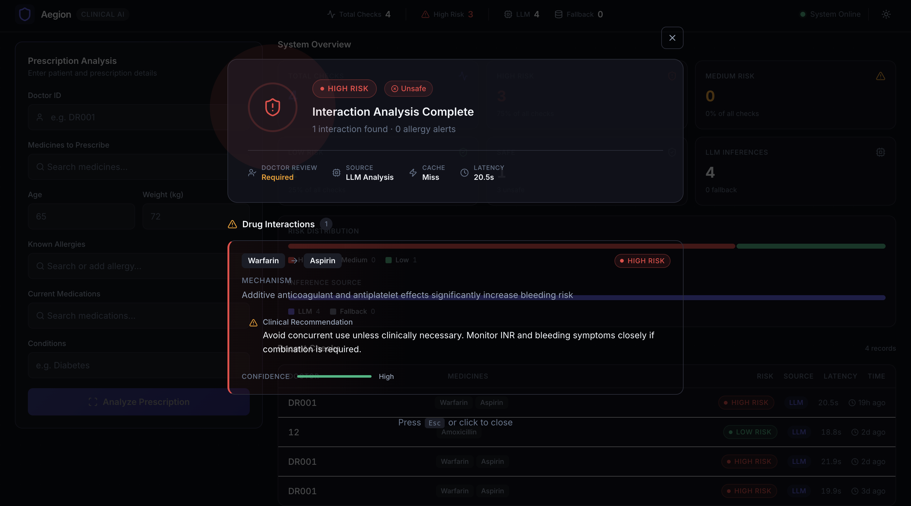

# Aegion — Clinical Drug Safety Engine

Aegion is a clinical drug safety engine that detects dangerous prescription drug interactions using a combination of AI and rule-based logic.

It runs entirely on your local machine using Ollama and Qwen 2.5 — no cloud, no external APIs, no patient data leaving the system. Every clinical output is backed by real drug interaction records retrieved from the OpenFDA database, not LLM guesswork.

---

## Tech Stack


---

## Highlights

- Hybrid RAG pipeline: PubMedBERT embeddings + BM25 keyword search + Reciprocal Rank Fusion
- OpenFDA drug interaction data stored and queried locally — no runtime internet required
- Every LLM output is grounded in retrieved clinical evidence from OpenFda dataset.
- AI + deterministic rule-based interaction detection working together
- Fully local inference — patient data never leaves the machine
- Built for DPDP Act compliance (India's healthcare data privacy law)
- Intelligent fallback to rule-based engine when AI inference fails
- TTL-based caching for ~95% faster repeated drug checks
- Unified FastAPI + React app — single command to run
- Dashboard with latency tracking, cache status, risk distribution, and more

---

## Demo Video

[](https://youtu.be/sHV2bOIawo0)

---

# Why Aegion?

Most AI tools in healthcare rely on cloud APIs and give you answers without explaining where those answers come from. That creates three problems: patient data privacy risk, no way to verify if the output is correct, and the system going offline if the API is down.

Aegion was built to solve all three:

- Everything runs locally — no cloud, no data exposure
- Every interaction warning cites the OpenFDA dataset to give clean and accurate        response and prevent hallucination
- If the AI fails, a deterministic rule engine takes over automatically

---

# Core Features

### Hybrid RAG Pipeline

Before Qwen analyzes any drug pair, Aegion retrieves the most relevant drug interaction records from a locally stored OpenFDA knowledge base. Qwen reads these records and uses them as evidence — like a doctor consulting a reference book before answering, instead of relying purely on memory.

### PubMedBERT Embeddings

Drug interaction data is medical text. Aegion uses `pritamdeka/S-PubMedBert-MS-MARCO` — a model trained on 14 million PubMed biomedical abstracts — to convert that text into searchable vectors. This gives better retrieval accuracy on clinical terms than general-purpose embedding models.

### Weighted Hybrid Search (BM25 + Semantic)

Retrieval uses two search methods running together:

- **BM25** (keyword search) — finds chunks where the drug name appears exactly. Drug names like "Warfarin" are exact terms, so keyword matching is more precise here.
- **Semantic search** — finds chunks that are conceptually similar, even if the exact name doesn't appear. Useful for catching drug class interactions like "NSAIDs increase bleeding risk."

Results from both are merged using Reciprocal Rank Fusion with a 90/10 weighting toward BM25, since exact drug name matching matters most in clinical retrieval.

### Entity Filtering

Chunks are only passed to Qwen if both queried drug names appear in the text. This prevents Qwen from making up a connection between two drugs based on a chunk that only mentions one of them.

### Three-Tier Confidence System

Every output includes a confidence level so clinicians know how much to trust it:

```
High confidence   → retrieved OpenFDA evidence directly mentions the drug pair
Medium confidence → partial evidence found
Low confidence    → no relevant records found, AI used its own knowledge
                    (requires_doctor_review automatically set to true)
```

### Deterministic Fallback Engine

If AI inference fails for any reason, the system automatically falls back to a rule-based engine that checks known unsafe drug combinations from a structured local database. The system never returns an empty response.

### Explainable Output

Every response includes the interaction mechanism, clinical impact, recommendation, and confidence level — not a black-box yes/no answer.

### Operational Dashboard

Tracks inference latency, cache hit/miss, source (AI vs fallback), risk distribution, confidence levels, and recent prescription checks.

---

# How It Works

```text
Doctor enters drug names
        ↓
Check cache (TTL-based) — return instantly if seen before
        ↓
Rule-based engine checks known unsafe combinations
        ↓
RAG Retrieval:
  ├── Search OpenFDA knowledge base per drug and per drug pair
  ├── BM25 keyword search + PubMedBERT semantic search
  ├── Merge results with Reciprocal Rank Fusion (90/10 BM25/semantic)
  └── Filter to chunks containing both drug names
        ↓
Qwen 2.5 reads retrieved evidence and analyzes the interaction
        ↓
Classify severity and confidence
        ↓
Log to database
        ↓
Return grounded clinical response
```

---

# Architecture

## RAG Knowledge Base

The RAG knowledge base is pre-built and shipped with the repository via Git LFS. It was built from the OpenFDA drug label bulk dataset — 4,979 records containing clinical interaction data, split into 600-word chunks with 100-word overlap, embedded using PubMedBERT, and stored in ChromaDB. A BM25 index was built over the same chunks and saved to disk.

Users who clone the repo get the fully built knowledge base immediately. No data download or ingestion step required. All retrieval happens locally with no internet connection needed at runtime.

## Retrieval Strategy

For each prescription check, the retriever runs separate searches for every drug and every drug pair in the input:

```
Input: ["Warfarin", "Ibuprofen"]

Queries:
  "Warfarin drug interactions contraindications"
  "Ibuprofen drug interactions contraindications"
  "Drug interaction between Warfarin and Ibuprofen"

Each query runs BM25 + semantic search.
Results merged via weighted RRF.
Only chunks containing both drug names are kept.
Top 5 chunks are sent to Qwen.
```

## Local LLM Inference

Qwen 2.5 runs locally via Ollama. It receives the retrieved chunks as context alongside the patient details and returns a structured JSON response. The system prompt enforces strict JSON output so responses can be reliably parsed.

## Deterministic Safety Layer

A fallback interaction engine checks a local `fallback_interactions.json` file containing known unsafe drug combinations. This runs independently of the AI pipeline and acts as a safety net.

## Caching

A TTL-based cache stores recent prescription analyses. Repeated checks on the same drug combination return in milliseconds instead of waiting for LLM inference.

## Database

SQLAlchemy ORM with SQLite stores all prescription checks. Switching to PostgreSQL requires no code changes — only a connection string update.

---

# Dashboard

The Aegion dashboard shows:

- Prescription analysis form
- Interaction severity and confidence visualization
- Inference source (AI or fallback)
- Cache hit/miss status
- Latency per request
- Risk distribution across all checks
- Recent prescription history

The UI is designed to look like an operational clinical tool, not a chatbot.

---

# Project Structure

```text
backend/
├── data/
│   ├── fallback_interactions.json
│   └── drug-label-0001.json        ← OpenFDA bulk dataset
├── prompts/
│   └── system_prompt.txt
├── chroma_db/                      ← ChromaDB vector store (included via Git LFS)
├── bm25_index.pkl                  ← BM25 keyword index (included via Git LFS)
├── embedder.py                     ← PubMedBERT embedding module
├── ingest.py                       ← One-time knowledge base setup script
├── retriever.py                    ← Hybrid RAG retrieval engine
├── cache.py
├── database.py
├── db_models.py
├── engine.py
├── main.py
└── requirements.txt

frontend/
├── api/
├── components/
├── constants/
├── context/
├── hooks/
└── App.jsx
```

---

# Running Aegion Locally

## 1. Clone the Repository

```bash
git clone https://github.com/Shyaam-04/aegion.git
cd aegion
```

## 2. Install Backend Dependencies

```bash
cd backend
pip install -r requirements.txt
```

## 3. Install Ollama

Download and install Ollama from https://ollama.com

## 4. Pull the Qwen Model

```bash
ollama pull qwen2.5
```

## 5. Run the Application

```bash
uvicorn main:app --reload
```

Frontend and backend run together from a single command.

---

# Screenshots

## Dashboard Overview


## Clinical Interaction Analysis



---

# Key Engineering Decisions

**Why Qwen 2.5 instead of a medical LLM like BioMistral**
Medical LLMs were tested but consistently failed to follow the strict JSON output format the system requires. A malformed response in a clinical system is a safety risk. Qwen 2.5 produced reliable structured outputs. With RAG providing the clinical knowledge, a disciplined general model works better than an unpredictable specialist one.

**Why PubMedBERT instead of a general embedding model**
Drug interaction text is medical language. A model trained on 14 million biomedical abstracts understands clinical terminology better than one trained on general web text. Better embeddings mean better retrieval, which means better LLM outputs.

**Why 90/10 BM25/semantic weighting**
Drug names are exact identifiers. "Warfarin" should match chunks that say "Warfarin" — not chunks that semantically relate to anticoagulants. BM25 handles this precisely. Semantic search is kept at 10% to catch broader drug class interactions that BM25 might miss.

**Why entity filtering**
Without it, the retriever sometimes returned chunks that mentioned only one of the two queried drugs. Qwen would then hallucinate a connection. Entity filtering requires both drug names to appear in a chunk before it reaches Qwen — eliminating that failure mode.

**Why local bulk ingestion instead of live API calls**
Querying OpenFDA at runtime would add network latency, create rate limit risk, and introduce an external dependency. Ingesting once and storing locally keeps the entire system air-gapped — consistent with the privacy-first design.

---

# Future Improvements

**DrugBank integration**
DrugBank is the most comprehensive structured drug interaction database available, curated by pharmacologists. Academic access is temporarily paused. Integration is planned when downloads resume — the ingestion pipeline already supports multiple data sources.

**Full OpenFDA corpus**
The current setup uses 1 of 13 available bulk files, covering ~4,979 records. Ingesting all 13 files would expand coverage to ~40,000 interaction records and improve recall for less common drug combinations.

**Faster ingestion with async embeddings**
Ingestion is currently sequential. Parallelizing the embedding step would bring setup time from 30–45 minutes down to under 10 minutes.

**PostgreSQL migration**
SQLAlchemy already abstracts the database layer. Switching from SQLite to PostgreSQL is a one-line connection string change.

**Docker deployment**
Packaging Ollama, ChromaDB, and the FastAPI app into a single Docker Compose stack would make on-premise deployment in clinical environments much simpler.

**EHR integration**
Connecting to Electronic Health Record systems would let clinicians run drug checks without manually entering patient history every time.